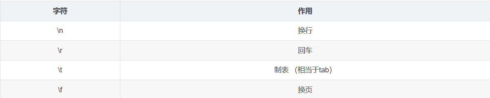

- [正则表达式匹配字符](#正则表达式匹配字符)
- [预定义字符类](#预定义字符类)
- [匹配POSIX字符类](#匹配posix字符类)

# 正则表达式匹配字符

| 编号  |     字符      |                描述                 |
| :---: | :-----------: | :---------------------------------: |
|   1   |       x       |              匹配字符x              |
|   2   |     \\\\      |            反斜杠(\)字符            |
|   3   |      \0n      |      八进制值为0n的字符(0≤n≤7)      |
|   4   |    \\\\0nn    |     八进制值为0nn的字符(0≤n≤7)      |
|   5   |     \0mnn     |  八进制值为0mnn(0≤m≤3,0≤n≤7)的字符  |
|   6   |     \xhh      |      具有十六进制值0xhh的字符       |
|   7   |    \uhhhh     |      十六进制值为0xhhhh的字符       |
|   8   |      \t       |          制表符('\u0009')           |
|   9   |      \n       |          换行符('\u000A')           |
|  10   |      \r       |          回车符('\u000D')           |
|  11   |      \f       |         换页字符('\u000C')          |
|  12   |     [abc]     |        匹配a，b或c(简单类)。        |
|  13   |    [^abc]     |   除a，b或c之外的任何字符(否定)。   |
|  14   |   [a-zA-Z]    |      a到z或A到Z，包括(范围)。       |
|  15   |  [a-d[m-p]]   |   a到d，或m到p:[a-dm-p]\(联合\)。   |
|  16   | [a-z&&[def]]  |           d，e或F(交集)。           |
|  17   | [a-z&&[^bc]]  |   a到z，b和c除外：[ad-z]\(减法\)    |
|  18   | [a-z&&[^m-p]] | a到z，而不是m到p:[a-lq-z]\(减法\)。 |

eg:com.der.regularexpression.lessonTwo.MetacharacterStudy#testMatchCharacters

# 预定义字符类

| 编号  |   字符   |                    描述                    |
| :---: | :------: | :----------------------------------------: |
|   1   | 点符号 . | 任何字符(可能与行终止符匹配也可能不匹配)。 |
|   2   |    \d    |                数字:[0-9]。                |
|   3   |    \D    |              非数字:[^0-9]。               |
|   4   |    \s    |         空格字符:[\t\n\x0B\f\r\n]          |
|   5   |    \S    |             非空白字符:[^\s]。             |
|   6   |    \w    |          单词字符:[a-zA-Z_0-9]。           |
|   7   |    \W    |              非单词字符:[^\w]              |

eg:com.der.regularexpression.lessonTwo.MetacharacterStudy#testPredefinedCharacter

# 匹配POSIX字符类

| 编号  |    字符    |                        描述                         |
| :---: | :--------: | :-------------------------------------------------: |
|   1   | \p{Lower}  |                小写字母字符:[a-z]。                 |
|   2   | \p{Upper}  |                大写字母字符:[A-Z]。                 |
|   3   | \p{ASCII}  |               所有ASCII:[\x00-\x7F]。               |
|   4   | \p{Alpha}  |           字母字符:[\p{Lower}\p{Upper}]。           |
|   5   | \p{Digit}  |                 十进制数字:[0-9]。                  |
|   6   | \p{Alnum}  |         字母数字字符:[\p{Alpha}\p{Digit}]。         |
|   7   | \p{Punct}  | 标点符号:!”#$%&’()*+,-./:;<=>?@[]^_>{Ι}< 其中一个。 |
|   8   | \p{Graph}  |       一个可视的字符: [\p{Alnum}\p{Punct}]。        |
|   9   | \p{Print}  |            可打印字符:[\p{Graph}\x20]。             |
|  10   | \p{Blank}  |                空格或制表符:[ \t]。                 |
|  11   | \p{XDigit} |             十六进制数字:[0-9a-fA-F]。              |
|  12   | \p{Space}  |              空白字符:[ \t\n\x0B\f\r]               |

eg:com.der.regularexpression.lessonTwo.MetacharacterStudy#testPosixCharacter